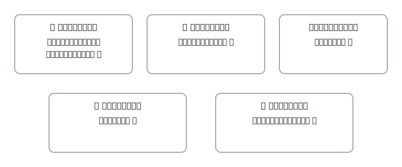

# 2. まずは用語をやさしく：5要素と代表科目

{: .figure }

### 5要素を“ひらがな説明”に置き換える

| 要素   | ひらがな説明       | 例                           |
| ------ | ------------------ | ---------------------------- |
| 資産   | 自分の持ち物       | 現金・普通預金・売掛金・備品 |
| 負債   | 借りているもの     | 買掛金・借入金・未払金       |
| 純資産 | 持ち主の取り分     | 資本金 等                    |
| 収益   | 入ってくるはたらき | 売上・受取利息               |
| 費用   | 出ていくはたらき   | 仕入・消耗品費・水道光熱費   |

> **左（借方）で増える**：資産・費用 ／ **右（貸方）で増える**：負債・純資産・収益。

### よく使う代表科目（最初の10語）

- 資産：現金／普通預金／当座預金／売掛金／備品
- 負債：買掛金／借入金
- 収益：売上／受取利息
- 費用：消耗品費／支払手数料

> 難しそうなら、まずは**上の10語**だけでOK。次の章で少しずつ増やします。
