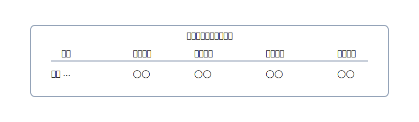

# 4. 集計：試算表で全体を点検する

{: .figure }

> 仕訳と転記が合っていれば、**試算表**の合計は左右で一致します。

## 3種類の“試算表”の感覚

- **合計試算表**：各科目の借方合計と貸方合計を並べる（動きの総量）
- **残高試算表**：各科目の残高だけを並べる（期末の位置）
- **合計残高試算表**：上の2つを合体したもの（最も使われる）

### ミニ見本（合計残高試算表のイメージ）

| 科目     |   借方合計 |  貸方合計 |   借方残高 |  貸方残高 |
| -------- | ---------: | --------: | ---------: | --------: |
| 現金     |      1,000 |     1,200 |            |       200 |
| 普通預金 |     30,000 |           |     30,000 |           |
| 売上     |            |     1,000 |            |     1,000 |
| 消耗品費 |      1,200 |           |      1,200 |           |
| **合計** | **32,200** | **2,200** | **31,200** | **1,200** |

> ここで左右の合計や、残高の妥当性を<strong>ざっくり言葉で説明できるか</strong>が合格ラインです。
