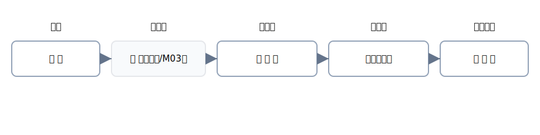

# 第2章 取引→仕訳→転記→集計 — 1本のすべり台をすべるように

この章は、<strong>「1つの取引が、どのように帳簿に定着していくか」</strong>を、ゆっくり丁寧に追いかけます。 
合言葉は <strong>事実 → 記録 → 整理 → 全体確認</strong>。図と豊富な文章で、つまずきやすい箇所を先回りして解消します。

{: .figure }
M03 で学ぶ「伝票」は任意の指示書。本章では「仕訳帳→元帳→試算表」を中心に。

## この章でできるようになること

- 取引（事実）から<strong>仕訳</strong>を作り、<strong>元帳へ転記</strong>し、<strong>試算表</strong>で確認できる
- <strong>合計</strong>と<strong>残高</strong>の違いを言葉で説明できる
- 4列仕訳（借方科目・金額／貸方科目・金額）を<strong>安定して</strong>書ける

## セクション

1. [取引の正体：証ひょうを読む](01-transaction.md)
2. [仕訳帳：4列の“ことば”で事実を記録](02-journal.md)
3. [転記：元帳に移して残高を作る](03-posting.md)
4. [集計：試算表で全体を点検する](04-trial-balance.md)
5. [章末クイズ](99-quiz.md)
