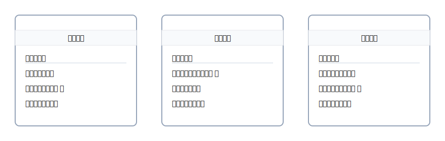

# 2. 伝票（入金・出金・振替）の使い分け

伝票は、仕訳を“書きやすくするための<strong>指示書</strong>”。 
<strong>入金・出金・振替</strong>の3兄弟だけ覚えれば、迷いが一気に減ります。

{: .figure }

## 3兄弟の早見表

<table class="table-compact">
  <thead><tr><th>伝票</th><th>どんなとき？</th><th>右（貸方）</th><th>左（借方）の代表例</th></tr></thead>
  <tbody>
    <tr><td>入金伝票</td><td>お金が入ってきた</td><td>—</td><td>現金／普通預金</td></tr>
    <tr><td>出金伝票</td><td>お金を払った</td><td>現金</td><td>費用・仕入 等</td></tr>
    <tr><td>振替伝票</td><td>現金を使わない移動</td><td>資産・負債 等</td><td>資産・費用 等</td></tr>
  </tbody>
</table>
<small class="hint">※ 入金伝票は実務では「借方：現金等」を意識、右は相手科目がくる設計です。</small>

### ミニ例題（公式4列）

> 「小切手を振り出して備品20,000円を購入」  
> 右（出る）＝当座預金、左（入る/増える）＝備品

| 借方科目 |   金額 | 貸方科目 |   金額 |
| -------- | -----: | -------- | -----: |
| 備品     | 20,000 | 当座預金 | 20,000 |

> 「得意先から売掛金50,000円を振込で回収」  
> 右＝売掛金の減少、左＝普通預金の増加

| 借方科目 |   金額 | 貸方科目 |   金額 |
| -------- | -----: | -------- | -----: |
| 普通預金 | 50,000 | 売掛金   | 50,000 |

> 迷ったら：<kbd class="k">手段で右を決める → 左を考える → 金額一致</kbd>
