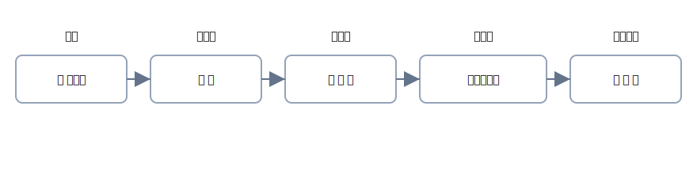

# 第3章 帳簿と伝票 — 「お金の足跡」をきれいに残す

レシート1枚から、試算表まで。 
この章では、<strong>証ひょう → 伝票 → 仕訳 → 元帳 → 試算表</strong>の流れを、図と表でやさしくたどります。

{: .figure }

## 学習のゴール

- 「入金・出金・振替」<strong>3種類の伝票の役割</strong>を説明できる
- 証ひょうから<strong>4列の仕訳</strong>に正しく落とし込める
- 仕訳帳→総勘定元帳→試算表の<strong>役割の違い</strong>を言える

## セクション

1. [帳簿の全体像と役割](01-overview.md)
2. [伝票（入金・出金・振替）の使い分け](02-vouchers.md)
3. [証ひょうから試算表へ：1枚のレシートの旅](03-flow.md)
4. [章末クイズ](99-quiz.md)

> 本章の構成は、日商簿記 初級の出題範囲（帳簿・現金預金の期中処理 等）に沿っています。[^ref]
> [^ref]: 出題範囲の根拠：日商簿記初級の公式資料に基づく整理です。
