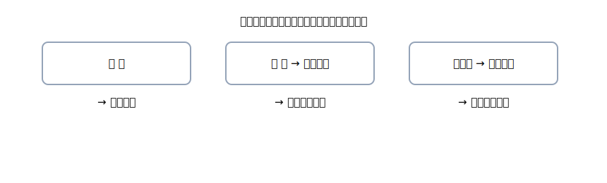

# 2. 手段→勘定：右を先に決めるルール

{: .figure }

<strong>迷ったら“手段で右”</strong>。まず右が決まると、左は自然に絞れます。

## よく使う3つの手段

- **現金**：レジで払う／手渡し
- **振込**：銀行から出入り（＝普通預金が動く）
- **小切手**：当座預金が動く

### ミニ例題（全部、公式4列）

> 「現金売上 1,000円」→ 右は売上（収益が増える）／左は現金（資産が増える）

| 借方科目 |  金額 | 貸方科目 |  金額 |
| -------- | ----: | -------- | ----: |
| 現金     | 1,000 | 売上     | 1,000 |

> 「現金を銀行に預けた 30,000円」→ 右は現金／左は普通預金（資産同士の移動）

| 借方科目 |   金額 | 貸方科目 |   金額 |
| -------- | -----: | -------- | -----: |
| 普通預金 | 30,000 | 現金     | 30,000 |

> 「小切手で備品を買った 20,000円」→ 右は当座預金／左は備品

| 借方科目 |   金額 | 貸方科目 |   金額 |
| -------- | -----: | -------- | -----: |
| 備品     | 20,000 | 当座預金 | 20,000 |

> ここまでで、右から決める感覚はだいぶつかめてきます。
