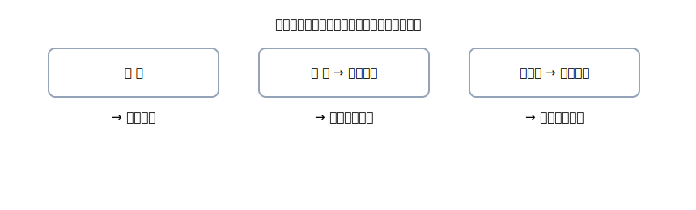

# 第4章 現金・預金（基礎） — まずは“右から決める”だけ！

お金まわりは難しそう？大丈夫。 
この章は、<strong>いちばん出番が多い基本の3つ</strong>だけに集中します。 
<strong>現金／普通預金／当座預金</strong>。たったこれだけで、仕訳の半分は勝てます。

{: .figure }
手段が決まれば、右（貸方）が先に決まる。あとは左（何のため？）と金額。

## この章でできるようになること

- その場で<strong>右（出ていく側）</strong>を即決できる（現金／普通／当座）
- 代表的な取引を<strong>公式4列</strong>でサッと書ける
- ありがちミスを<strong>チェックリスト</strong>で自力修正できる

## セクション

1. [まずはここから：現金・預金の素振り](01-basics.md)
2. [手段→勘定：右を先に決めるルール](02-methods-to-accounts.md)
3. [超頻出！10のパターンで定着](03-ten-patterns.md)
4. [ミスの芽をつむ：エラー＆チェック](04-errors-and-checklist.md)
5. [章末クイズ](99-quiz.md)
