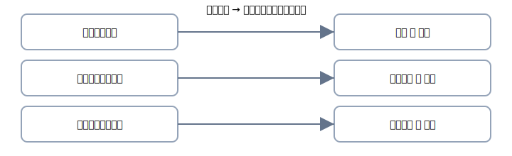

# 第5章 1節：勘定の性質と増減（やさしい版）

  <h4>ゴール</h4>
  <ul>
    <li>現金・普通預金・当座預金・定期預金は<strong>資産</strong></li>
    <li>増えたら<strong>借方（左）</strong>、減ったら<strong>貸方（右）</strong></li>
    <li>支払手段で使う勘定が決まる（現金 / 普通預金 / 当座預金）</li>
  </ul>

## まずは表で把握

| 勘定     | どんなもの？               | 増えたとき | 減ったとき |
| -------- | -------------------------- | ---------- | ---------- |
| 現金     | 手元のお金                 | 借方に書く | 貸方に書く |
| 普通預金 | 銀行口座（振込など）       | 借方       | 貸方       |
| 当座預金 | 小切手用の口座             | 借方       | 貸方       |
| 定期預金 | まとまった預金（期間あり） | 借方       | 貸方       |

!!! tip "覚え方（超シンプル）"
**現金で払う→現金が減る**  
 **振込で払う→普通預金が減る**  
 **小切手で払う→当座預金が減る**

### 例：現金を銀行に預けた

| 借方科目 |   金額 | 貸方科目 |   金額 |
| -------- | -----: | -------- | -----: |
| 普通預金 | 30,000 | 現金     | 30,000 |

---

## セクションミニクイズ（3問）

[章の目次へ](index.md)｜[次へ → 2節](02-patterns.md)
