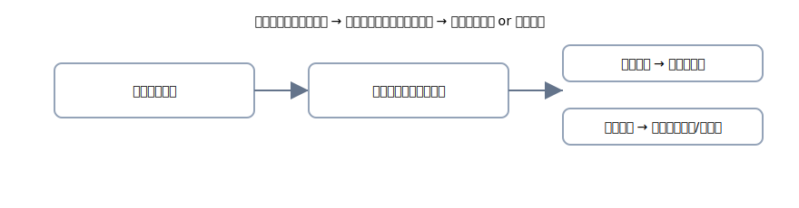

# 3. 現金過不足：その場しのぎ→原因判明→期末

{: .figure }

> 実際の現金と帳簿が合わない…そんな日は<strong>いったん“現金過不足”</strong>で落ち着かせます。

## A. 発見時（その場しのぎ）

- **不足**（数えてみたら足りない）

  | 借方科目   |  金額 | 貸方科目 |  金額 |
  | ---------- | ----: | -------- | ----: |
  | 現金過不足 | 1,000 | 現金     | 1,000 |

- **過剰**（多かった）

  | 借方科目 |  金額 | 貸方科目   |  金額 |
  | -------- | ----: | ---------- | ----: |
  | 現金     | 1,000 | 現金過不足 | 1,000 |

## B. 後で原因がわかったら（修正）

- 例：不足の理由が「旅費のつけ忘れ」だった

  | 借方科目   |  金額 | 貸方科目   |  金額 |
  | ---------- | ----: | ---------- | ----: |
  | 旅費交通費 | 1,000 | 現金過不足 | 1,000 |

## C. 期末まで判明しなかったら

- **不足のまま** → **雑損失**（費用）へ振替

  | 借方科目 |  金額 | 貸方科目   |  金額 |
  | -------- | ----: | ---------- | ----: |
  | 雑損失   | 1,000 | 現金過不足 | 1,000 |

- **過剰のまま** → **雑収入**（収益）へ振替

  | 借方科目   |  金額 | 貸方科目 |  金額 |
  | ---------- | ----: | -------- | ----: |
  | 現金過不足 | 1,000 | 雑収入   | 1,000 |

> いつも通り、文章にすると見取り図がクリアになります。
