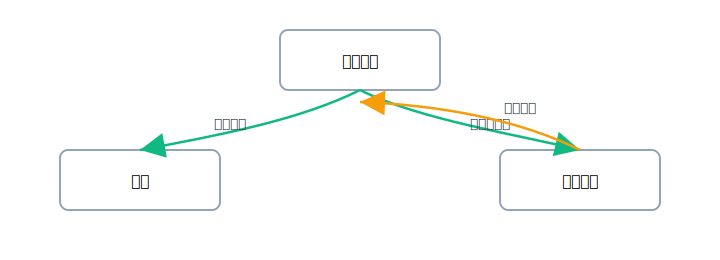

# 第5章 3節：資金移動・利息・手数料

  
講義スクリプト（導入 1分）

  
講師：

  
「ここは<strong>資産どうしの引越し</strong>と思ってください。右は“出ていく口座”、左は“入ってくる口座”。利息と手数料は科目名でスッと取れます。」

## 図で理解：資金の動き

{: .svg-center }

### よくある振替

| 取引           | 仕訳（4列）                    |
| -------------- | ------------------------------ |
| 普通→現金 引出 | （借）現金 /（貸）普通預金     |
| 普通→定期 預入 | （借）定期預金 /（貸）普通預金 |
| 定期 満期→普通 | （借）普通預金 /（貸）定期預金 |

### 利息・手数料

- **利息を受け取った** → 収益の **受取利息**（貸方）、入金先が増える（借方）
- **振込手数料を払った** → 費用の **支払手数料**（借方）、普通預金が減る（貸方）

!!! note "試験の前提"
初級は**税抜方式**で、特に指示がない限り消費税の計算は行いません。

---

## セクションミニクイズ（4問：複合仕訳あり）

[← 前へ：2節](02-patterns.md)｜[次へ → 章末クイズ](99-quiz.md)｜[章の目次へ](index.md)
