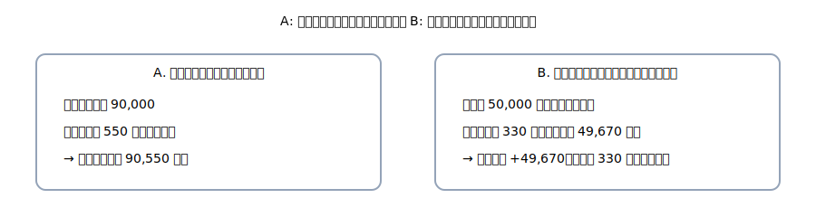

# 第5章 現金・預金（応用）— フィー・差引入金・現金過不足をまとめて攻略

基礎は OK。ここからは<strong>「ちょっと複雑」</strong>な場面を、かみ砕いてスッキリ片付けます。 
合言葉はいつも通り、<strong>右（出る）→ 左（入る）→ 金額一致</strong>。 
複合仕訳は<strong>2行に分ける</strong>と、公式4列が崩れません。

{: .figure }
A：こちらが払う（仕向）／B：受取側の口座で差引（被仕向）。

## この章でできるようになること

- 振込手数料・口座手数料・受取利息を<strong>4列で正確に</strong>処理できる
- 振込入金の<strong>差引パターン</strong>を、<strong>2行方式</strong>でスムーズに書ける
- <strong>現金過不足</strong>の原因判明・期末処理まで説明できる
- 通帳の表示（借／貸）が帳簿と逆に見える理由を<strong>言葉で説明</strong>できる

## セクション

1. [銀行手数料と受取利息](01-fees-and-interest.md)
2. [振込と差引入金：2行で解決](02-transfers-advanced.md)
3. [現金過不足：その場しのぎ→原因判明→期末](03-cash-over-short.md)
4. [通帳（銀行の目線）と覚え方メモ](04-passbook-and-notes.md)
5. [章末クイズ](99-quiz.md)

> 公式の解答様式（4列）を守るため、**複合は金額で2行**に割るのがコツです。
