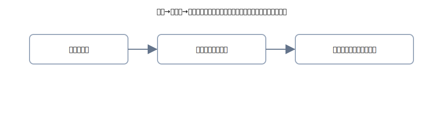

# 2. クレジット売掛金：カード売上と入金処理

{: .figure }

> 加盟店（あなた）の帳簿では、カード会社に対する債権を<strong>クレジット売掛金</strong>で管理します。

## 発生（売上）時

> お客様がカードで支払った瞬間：**クレジット売掛金**という“もらう権利”が生じます。

| 借方科目         |   金額 | 貸方科目 |   金額 |
| ---------------- | -----: | -------- | -----: |
| クレジット売掛金 | 50,000 | 売上     | 50,000 |

## 入金時：差引が普通（手数料控除）

{: .figure }

- 入金額：49,000 円、手数料：1,000 円、売上（総額）：50,000 円の例
- **2行に割る**と、4列の形が崩れません。

| 借方科目   |   金額 | 貸方科目         |   金額 |
| ---------- | -----: | ---------------- | -----: |
| 普通預金   | 49,000 | クレジット売掛金 | 49,000 |
| 支払手数料 |  1,000 | クレジット売掛金 |  1,000 |

> 合計で「クレジット売掛金 50,000」が消え、口座＋手数料に置き換わりました。
