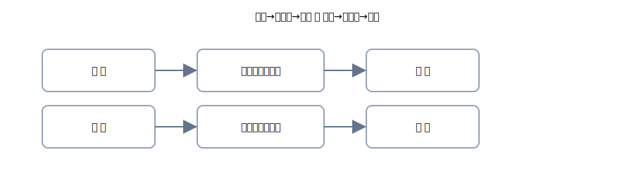

# 第6章 売掛金・買掛金・クレジット売掛金 —「掛け」の世界を気楽にマスター

いよいよ“掛け”の世界へ。とはいえ構えなくてOK。 
やることは<strong>いつもと同じ</strong>で、<strong>右（出る）→ 左（入る）→ 金額一致</strong>。 
この章では、売掛金・買掛金に加えて<strong>クレジット売掛金</strong>までを、図と<strong>たっぷりの文章</strong>でやさしく攻略します。

{: .figure }
売上→売掛金→入金 ／ 仕入→買掛金→支払。まずは流れを文でつかむ。

## この章でできるようになること

- 「掛け」の意味を<strong>日本語で説明</strong>できる（売掛金＝後でもらう権利／買掛金＝後で払う義務）
- 売掛・買掛の<strong>期中処理</strong>を4列で安定して書ける
- <strong>クレジット売掛金</strong>の発生と入金（差引）を2行方式で処理できる
- 試算表と相手先合計の<strong>ざっくり突合</strong>がイメージできる

## セクション

1. [売掛金・買掛金の基本と“掛け”の考え方](01-ar-ap-basics.md)
2. [クレジット売掛金：カード売上と入金処理](02-credit-sales.md)
3. [返品・値引の扱い（売上／仕入）](03-returns-and-allowances.md)
4. [締めと突合：試算表での確認とコツ](04-reconcile-and-tips.md)
5. [章末クイズ](99-quiz.md)

> 公式の4列表記（借方科目・金額／貸方科目・金額）で統一。複合は<strong>2行</strong>に割るのが鉄則です。
