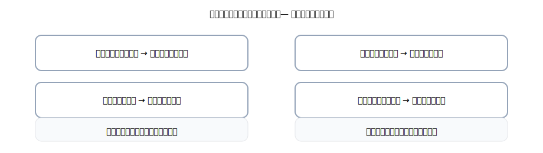

# 1. まずは地図：その他の債権・債務とは

> いわば「**売上・仕入以外**の“あとでもらう/あとで払う”」。まずは日本語でつかむのが近道。

{: .figure }

## ひとことで

- **未収入金** … 売上以外でもらうはずの代金（例：備品を売った代金が未収）
- **未払金** … 売上以外で払うはずの代金（例：備品を買って未払い）
- **前払金** … 先に払った前金（まだ商品・サービスは受け取っていない）
- **前受金** … 先にもらった前受け（まだ商品・サービスを渡していない）
- **立替金** … 他人の代わりに払っておいたお金（あとで回収）
- **預り金** … 他人から預かったお金（あとで渡す／納付する）
- **仮払金** … 内容未確定の前渡し（仮置き）
- **仮受金** … 内容未確定の預かり（仮置き）

> 使い分けの合言葉：「**だれのために動いた？**」「**中身は確定？**」
