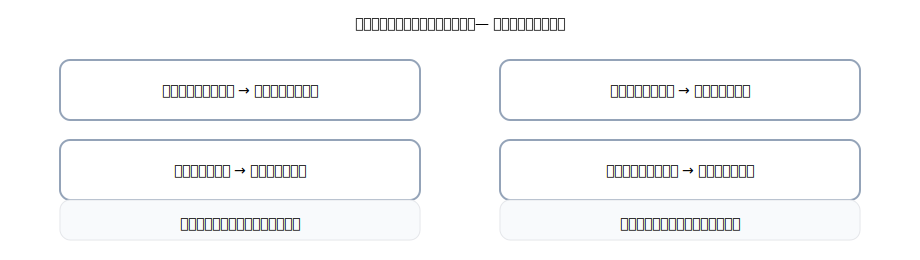

# 第7章 その他の債権・債務 — 「売買以外」のお金の約束をやさしく整理

ここでは<strong>商品売買以外</strong>の「あとでもらう／あとで払う」をまとめて攻略します。 
キーワードは<strong>だれに対して？何のために？いつお金？いつモノ？</strong>。 
型に落とすとスッと書けます。いつもの合言葉、<strong>右（出る）→ 左（入る）→ 金額一致</strong>でいきましょう。

{: .figure }
未収入金・未払金／前払金・前受金／立替金・預り金／仮払金・仮受金の位置づけ。

## この章でできるようになること

- 売買以外の<strong>未収入金・未払金</strong>、前金の<strong>前払金・前受金</strong>を言葉で説明→4列で書ける
- **立替金・預り金**、**仮払金・仮受金**の違いを<strong>一言で説明</strong>できる
- ありがちミス（科目の取り違え）を<strong>チェックリスト</strong>で自力修正
- 章末クイズで<strong>16問</strong>の実戦練習

## セクション

1. [まずは地図：その他の債権・債務とは](01-overview.md)
2. [前金・未収・未払：タイムラインで理解](02-advance-and-unsettled.md)
3. [立替・預り・仮払・仮受：一時置きと代払い](03-employee-and-temp.md)
4. [頻出パターン＆運用のコツ](04-patterns-and-tips.md)
5. [章末クイズ](99-quiz.md)

> 本章の内容（未収入金・未払金・前払金・前受金・立替金・預り金・仮払金・仮受金）は、簿記初級の期中処理の出題範囲に含まれます（決算整理の経過勘定と混同しない！）。
