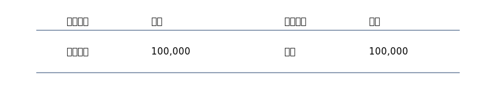

# 1. 手形のキホン（受取手形・支払手形）

> ひとことで言うと、**将来のお金の約束を紙で表したもの**。受け取る権利＝受取手形（資産）、支払う義務＝支払手形（負債）。

## 用語をやさしく

- **受取手形**：のちほどお金をもらえる“紙の約束”（資産）
- **支払手形**：のちほどお金を払う“紙の約束”（負債）
- **満期**：その日に支払/入金が行われる予定日

{: .figure }

## まずは2つの仕訳（超基本）

### ① 受取手形で売上（100,000 円）

| 借方科目 |    金額 | 貸方科目 |    金額 |
| -------- | ------: | -------- | ------: |
| 受取手形 | 100,000 | 売上     | 100,000 |

### ② 支払手形で仕入（80,000 円）

| 借方科目 |   金額 | 貸方科目 |   金額 |
| -------- | -----: | -------- | -----: |
| 仕入     | 80,000 | 支払手形 | 80,000 |

> “紙の約束”があるだけで、現金はまだ動きません。満期日にお金が動きます。
