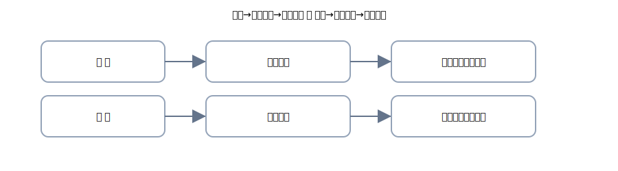
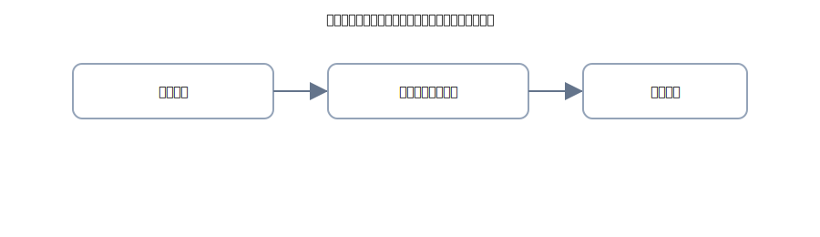

# 2. 発生→決済：手形の取引を4列で

{: .figure }

## A. 満期の到来（受取手形）

**③ 受取手形の取立入金（100,000 円）**

| 借方科目 |    金額 | 貸方科目 |    金額 |
| -------- | ------: | -------- | ------: |
| 普通預金 | 100,000 | 受取手形 | 100,000 |

## B. 満期の到来（支払手形）

**④ 支払手形の決済（80,000 円）**

| 借方科目 |   金額 | 貸方科目 |   金額 |
| -------- | -----: | -------- | -----: |
| 支払手形 | 80,000 | 普通預金 | 80,000 |

## C. 裏書で支払に回す（イメージ）

> 受取手形を取引先への支払にそのまま使うことを「裏書譲渡」といいます（初級はイメージだけ）。

{: .figure }

**⑤ 受取手形を買掛金の支払に回した（60,000 円）**

| 借方科目 |   金額 | 貸方科目 |   金額 |
| -------- | -----: | -------- | -----: |
| 買掛金   | 60,000 | 受取手形 | 60,000 |

> “受け取る権利”を手形で渡すので、受取手形が減り、買掛金が消えます。
