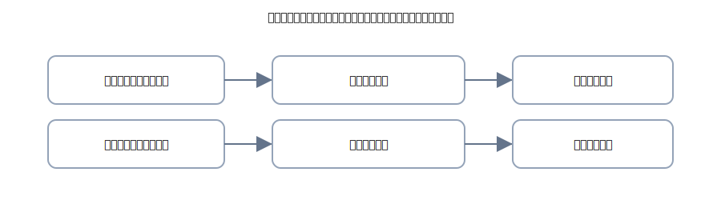

# 3. 電子記録債権・債務（でんさい）

{: .figure }

> 紙の代わりに**データで約束**を管理するのが「電子記録債権・債務」。会計処理は手形に近いです。

## A. 発生時

**⑥ 電子記録債権で売上（120,000 円）**

| 借方科目     |    金額 | 貸方科目 |    金額 |
| ------------ | ------: | -------- | ------: |
| 電子記録債権 | 120,000 | 売上     | 120,000 |

**⑦ 電子記録債務で仕入（90,000 円）**

| 借方科目 |   金額 | 貸方科目     |   金額 |
| -------- | -----: | ------------ | -----: |
| 仕入     | 90,000 | 電子記録債務 | 90,000 |

## B. 決済時

**⑧ 電子記録債権の入金（120,000 円）**

| 借方科目 |    金額 | 貸方科目     |    金額 |
| -------- | ------: | ------------ | ------: |
| 普通預金 | 120,000 | 電子記録債権 | 120,000 |

**⑨ 電子記録債務の支払（90,000 円）**

| 借方科目     |   金額 | 貸方科目 |   金額 |
| ------------ | -----: | -------- | -----: |
| 電子記録債務 | 90,000 | 普通預金 | 90,000 |

## C. 手数料（記録・管理など）

**⑩ 手数料 330 円が引き落とされた**

| 借方科目   | 金額 | 貸方科目 | 金額 |
| ---------- | ---: | -------- | ---: |
| 支払手数料 |  330 | 普通預金 |  330 |

> 実務では名称がさまざま（記録料 等）。初級では「支払手数料」でOK。
