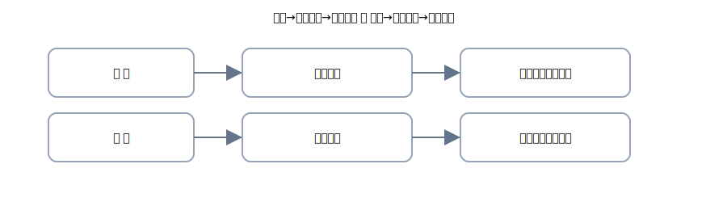

# 第8章 手形・電子記録債権債務 —「紙」と「データ」の約束をまとめて理解

ここは“約束の紙 or データ”の章。 
登場人物は <strong>受取手形／支払手形</strong> と <strong>電子記録債権／電子記録債務（でんさい）</strong>。 
やることはいつも通り、<strong>右（出る）→ 左（入る）→ 金額一致</strong>を4列で守るだけ。肩の力を抜いて進みましょう。

{: .figure }
売上→受取手形→満期入金／仕入→支払手形→満期支払。

## この章でできるようになること

- 手形とでんさいの<strong>立ち位置</strong>を日本語で説明できる
- 発生→決済（満期）までを<strong>公式4列</strong>で安定して書ける
- （応用）裏書・差入・割引の<strong>言葉のイメージ</strong>をつかめる
- 章末クイズで<strong>18問</strong>の練習

## セクション

1. [手形のキホン（受取手形・支払手形）](01-notes-basics.md)
2. [発生→決済：手形の取引を4列で](02-notes-transactions.md)
3. [電子記録債権・債務（でんさい）](03-densai.md)
4. [運用のコツ＆よくある質問](04-tips-and-qa.md)
5. [章末クイズ](99-quiz.md)

> 本章は初級レベルの範囲内で解説。割引・不渡などの詳細は深追いせず、まずは「約束→決済」をまっすぐ理解します。
