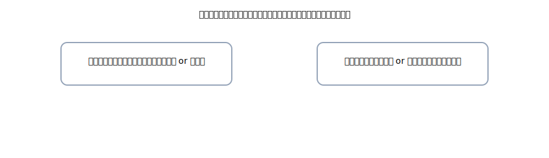

# 3. 返品・値引（売上返品／仕入返品）

{: .figure }

> 名前が示す通り、**売上を取り消すなら「売上返品」**、**仕入を取り消すなら「仕入返品」**。三分法では<strong>期中は原則これでOK</strong>。

## A. 売上側の取り消し

**⑨ 掛け売上 20,000 円のうち、5,000 円が返品に（入金前）**

| 借方科目 |  金額 | 貸方科目 |  金額 |
| -------- | ----: | -------- | ----: |
| 売上返品 | 5,000 | 売掛金   | 5,000 |

**⑩ 現金売上 10,000 円の返品に対し、すぐ返金**

| 借方科目 |   金額 | 貸方科目 |   金額 |
| -------- | -----: | -------- | -----: |
| 売上返品 | 10,000 | 現金     | 10,000 |

## B. 仕入側の取り消し

**⑪ 掛け仕入 15,000 円のうち、3,000 円を返品**

| 借方科目 |  金額 | 貸方科目 |  金額 |
| -------- | ----: | -------- | ----: |
| 買掛金   | 3,000 | 仕入返品 | 3,000 |

**⑫ 現金仕入 8,000 円の返品で、現金を受け取った**

| 借方科目 |  金額 | 貸方科目 |  金額 |
| -------- | ----: | -------- | ----: |
| 現金     | 8,000 | 仕入返品 | 8,000 |

> 値引も基本は同じ処理（売上値引→売上返品、仕入値引→仕入返品）。摘要で理由を書けばOK。
