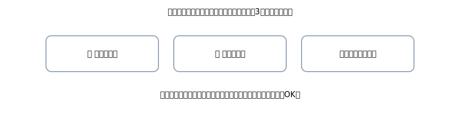

# 第9章 商品売買（三分法）・返品 — 在庫は“期末で整える”、仕訳は“今すぐ書く”

ここは<strong>商品売買</strong>の章。方式は<strong>三分法</strong>（さんぶんほう）。 
期中は「買ったら<strong>仕入</strong>」「売ったら<strong>売上</strong>」。在庫のことは<strong>期末にまとめて整える</strong>──この気楽さが三分法の良さです。 
合言葉はいつも通り、<strong>右（出る）→ 左（入る）→ 金額一致</strong>。返品や値引も、4列でサクッと処理できます。

{: .figure }
仕入（費用）／売上（収益）／繰越商品（資産）。期末に在庫で調整する方式。

## この章でできるようになること

- 三分法の<strong>考え方</strong>を日本語で説明できる
- 現金売買・掛売買・運賃/送料を<strong>公式4列</strong>で書ける
- <strong>売上返品・仕入返品</strong>の型を迷わず適用できる
- 期末調整（繰越商品）の<strong>イメージ</strong>がつかめる

## セクション

1. [三分法のキホン（3つの箱）](01-three-way-basics.md)
2. [日常処理：現金／掛け／運賃・送料](02-daily-transactions.md)
3. [返品・値引（売上返品／仕入返品）](03-returns-and-allowances.md)
4. [期末のイメージとよくあるミス](04-period-end-idea-and-tips.md)
5. [章末クイズ](99-quiz.md)
