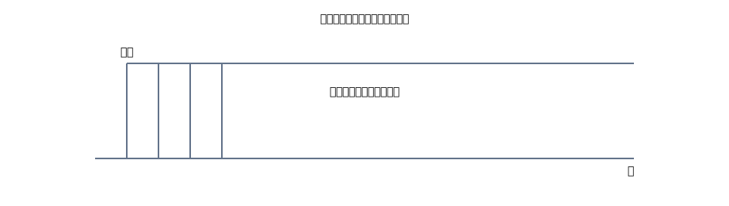

# 2. 減価償却のキホン：定額法をやさしく

{: .figure }
{: .figure }

> **定額法**：毎期同じ金額を**減価償却費**として計上。  
> キーワード：**取得原価・耐用年数・残存価額**（初級では残存価額=0とすることが多い）。

## まずは式（初級の定番）

- 年間の減価償却費 ＝ 取得原価 ÷ 耐用年数
- 月割りにする場合は さらに 12 で割る

## 仕訳の型（費用と累計額）

**② 当期の減価償却費（PC 取得原価 120,000、耐用年数 4年 → 年3万円の例）**
| 借方科目 | 金額 | 貸方科目 | 金額 |
|---|---:|---|---:|
| 減価償却費 | 30,000 | 減価償却累計額 | 30,000 |

> **減価償却累計額**は資産を直接減らさず、**別箱に“これまで費用化した合計”を積む**科目。結果として**帳簿価額＝取得原価−累計額**になります。
