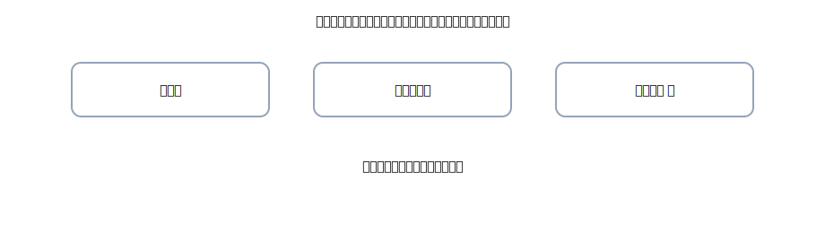

# 第10章 固定資産（取得・減価償却） — 長く使うモノは“いっぺんに費用にしない”

この章は<strong>固定資産</strong>（パソコン・備品・車など）の<strong>買い方と、費用への回し方（減価償却）</strong>がテーマです。 
キーワードは <strong>取得原価</strong> と <strong>定額法</strong>。やることはいつも同じ、<strong>右（出る）→ 左（入る）→ 金額一致</strong>、そして<strong>4列の型</strong>を守るだけ。

{: .figure }
買った値段 + 使える状態にするまでのコスト = 取得原価。

## できるようになること

- 取得原価の中身を<strong>日本語で説明</strong>できる（運搬・設置などを含める理由）
- **定額法**（毎期同じ金額）で<strong>減価償却費</strong>を計算・仕訳できる
- 帳簿価額（取得原価 − 減価償却累計額）を<strong>イメージ</strong>でつかめる
- ちょっと迷う「修繕＝費用／改良＝資産」を<strong>短文で判断</strong>できる

## セクション

1. [取得のキホン：何が取得原価？](01-acquisition-basics.md)
2. [減価償却のキホン：定額法をやさしく](02-depreciation-basics.md)
3. [例題で定着：金額→4列仕訳](03-depreciation-examples.md)
4. [修繕と改良：費用か資産か](04-maintenance-vs-capex.md)
5. [章末クイズ](99-quiz.md)

> 公式の4列（借方科目・金額／貸方科目・金額）で統一。複合は<strong>2行</strong>に割って形を保ちます。
