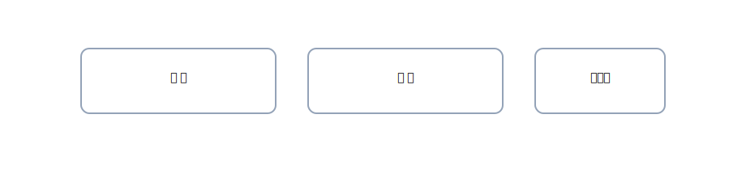

# 1. 純資産のキホン（会社／個人）

{: .figure }

> **純資産＝資産−負債**。言い換えれば「**持ち主の取り分**」です。

## A. 会社：資本金

**① 会社を設立し、出資 500,000 円が口座に入金された。**

| 借方科目 |    金額 | 貸方科目 |    金額 |
| -------- | ------: | -------- | ------: |
| 普通預金 | 500,000 | 資本金   | 500,000 |

## B. 個人：元入金

**② 個人事業を始め、現金 300,000 円を事業に持ち込んだ。**

| 借方科目 |    金額 | 貸方科目 |    金額 |
| -------- | ------: | -------- | ------: |
| 現金     | 300,000 | 元入金   | 300,000 |

**③ 追加で資金 50,000 円を口座へ入れた（追加の元入）。**

| 借方科目 |   金額 | 貸方科目 |   金額 |
| -------- | -----: | -------- | -----: |
| 普通預金 | 50,000 | 元入金   | 50,000 |

> ポイント：資本金・元入金は<strong>収益でも費用でもない</strong>。**純資産**の増減です。
