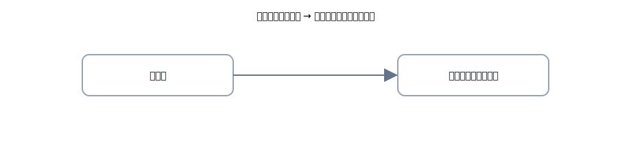

# 2. 引出金：生活費などの取り扱い

{: .figure }

> 生活費や私用の支払いを<strong>事業のお金から出したとき</strong>は、いったん<strong>引出金</strong>で受けます。期末に<strong>元入金へ戻す</strong>のがルール。

## A. 生活費の引出

**④ 生活費 20,000 円を普通預金から引き出した。**

| 借方科目 |   金額 | 貸方科目 |   金額 |
| -------- | -----: | -------- | -----: |
| 引出金   | 20,000 | 普通預金 | 20,000 |

**⑤ 私用の買い物 5,000 円を現金で支払った。**

| 借方科目 |  金額 | 貸方科目 |  金額 |
| -------- | ----: | -------- | ----: |
| 引出金   | 5,000 | 現金     | 5,000 |

## B. 期末の振替（引出金→元入金）

**⑥ 期末に、当期の引出金合計 100,000 円を元入金へ振り替えた。**

| 借方科目 |    金額 | 貸方科目 |    金額 |
| -------- | ------: | -------- | ------: |
| 元入金   | 100,000 | 引出金   | 100,000 |

> **引出金は費用ではありません。** 最終的に<strong>元入金（純資産）</strong>へ戻す「一時置き」です。
