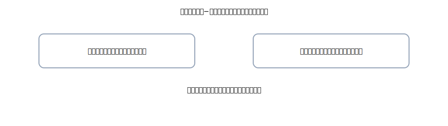

# 第11章 純資産（資本金・元入・引出）—「持ち主の取り分」をやさしく理解

ここでは<strong>純資産</strong>、つまり「お店の持ち主の取り分」をやさしく解説します。 
会社なら<strong>資本金</strong>、個人事業なら<strong>元入金</strong>。生活のためにお金を出し入れする動きは<strong>引出金</strong>でいったん受けて、期末に元入金へ戻します。 
合言葉は<strong>右（出る）→ 左（入る）→ 金額一致</strong>、そして<strong>4列仕訳</strong>。

{: .figure }
会社：資本金／個人：元入金。引出金は一時科目（期末に元入金へ振替）。

## できるようになること

- 「純資産＝持ち主の取り分」を<strong>日本語で説明</strong>できる
- 資本金（会社）・元入金（個人）の<strong>立ち位置</strong>がわかる
- 引出金の<strong>使いどころと期末振替</strong>を4列で書ける
- よくある取り違え（引出金を費用にしがち）を<strong>自力で修正</strong>できる

## セクション

1. [純資産のキホン（会社／個人）](01-equity-basics.md)
2. [引出金：生活費などの取り扱い](02-owner-drawings.md)
3. [追加の元入・個人→事業の立替](03-additional-capital.md)
4. [運用のコツ＆Q&A](04-tips-and-qa.md)
5. [章末クイズ](99-quiz.md)
