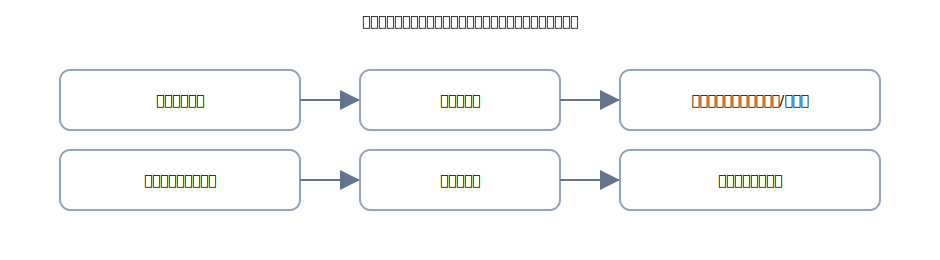

# 第12章 収益・費用と税金（税抜）—「本体」と「税」を分ければ怖くない

この章は<strong>収益・費用</strong>の基本に、<strong>消費税の税抜処理</strong>をのせて整理します。 
やることはいつも通り、<strong>右（出る）→ 左（入る）→ 金額一致</strong>、そして<strong>4列の型</strong>。 
ポイントは<strong>本体は売上/仕入・費用</strong>、<strong>税は仮受/仮払</strong>で分けること。

{: .figure }
税抜方式：本体は売上・仕入、消費税は仮受・仮払で受け、期末に差額を精算。

## できるようになること

- 収益・費用の<strong>立ち位置</strong>を短い日本語で説明できる
- 税抜方式で<strong>売上・仕入・経費</strong>を4列で書ける
- 期末に<strong>仮受と仮払を相殺</strong>するイメージがつかめる
- よくある誤り（全部を売上や仕入に入れてしまう 等）を避けられる

## セクション

1. [収益・費用のキホン](01-rev-exp-basics.md)
2. [税抜方式のキホン（仮受・仮払）](02-tax-excluded-basics.md)
3. [よくある取引パターン](03-patterns-and-examples.md)
4. [期末の精算（差額を未払/未収へ）](04-period-end-settlement.md)
5. [章末クイズ](99-quiz.md)

> 本章は初級レベルの範囲で扱います。税率の変更や細かな区分には立ち入りません。
